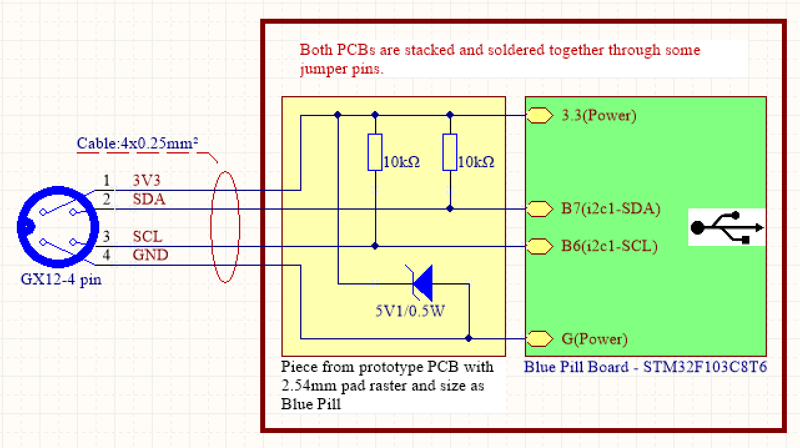

[БГ] iSTM32PSU-IIC е програма от тип фърмуер която заредена в така наречената
платка Blue Pill (с процесор STM32F103C8T6) я превръща в комуникационен
посредник между компютър с операционна система Windows изпълняващ  програма
stm32PSU и линейно захранване модел PSU_F030CCT6. Казано накратко - служи за
осъществяване на дистанционното  управление на линейното захранване. Подробна
информация за самото захранване, програмата за управлението му и детайли как да
изработите комуникационният кабел ще намерите на:
https://www.stm32dds.tk/stm32-psu
В края е приложена опростена структурна електрическа схема отразяваща
необходимите модификации за превръщането на Blue Pill в комуникационен кабел от
активен тип. 

[EN] The iSTM32PSU-IIC is a firmware program that, loaded into the so-called
Blue Pill board (with a STM32F103C8T6 processor), turns it into a communication
intermediary between a Windows computer running a stm32PSU program and a linear
power supply model PSU_F030CCT6. In short, it serves to implement the remote
control of the linear power supply. Detailed information about the power supply
itself, the program for its control and details on how to make the
communication cable can be found at:
https://www.stm32dds.tk/stm32-psu
At the end, a simplified structural wiring diagram is applied, reflecting the
necessary modifications for the transformation of the Blue Pill into an active
communication cable.

